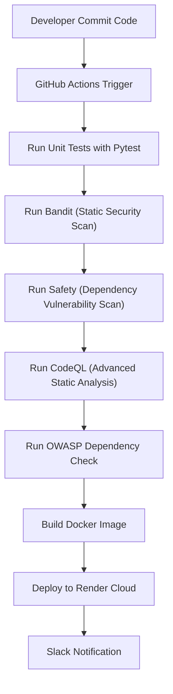

# 🚀 DevSecOps CI/CD Demo — Secure Flask Application  

A complete **DevSecOps Pipeline Project** integrating:  
✅ **Continuous Integration (CI)**  
✅ **Security Scanning (SAST + DAST)**  
✅ **Dockerized Deployment**  
✅ **Cloud Hosting (Render)**  
✅ **Slack Notifications**  

---

## 🌍 Live Render Deployment  
🔗 [View Live App][https://devsecops-demo-hm0g.onrender.com] 
  

---

## 📘 Project Overview  

This project demonstrates a **secure end-to-end CI/CD pipeline** for a Python Flask web app.  
The pipeline automatically runs tests, performs security scans, builds a Docker image, and deploys securely to Render.  

**Tech Stack:**  
- **Language:** Python (Flask)  
- **Testing:** Pytest  
- **CI/CD:** GitHub Actions  
- **Security:** Bandit, Safety, CodeQL, OWASP Dependency Check  
- **Containerization:** Docker  
- **Deployment:** Render Cloud  
- **Notifications:** Slack  

---

## 🧩 CI/CD Pipeline Overview

🔒 Security Automation Highlights
Tool	Purpose	Trigger
Bandit	Static code analysis for Python	On every push
Safety	Dependency vulnerability scanner	On every push
CodeQL	GitHub’s SAST (Advanced Analysis)	On push + weekly
OWASP Dependency Check	CVE detection for libraries	On push
Slack Notifications	Alerts on CI success/failure	Optional
Trivy (optional)	Container image vulnerability scan	Docker stage

⚙️ Setup Instructions
1️⃣ Clone Repository
git clone https://github.com/mohdzaid145256/devsecops-ci-demo.git
cd devsecops-ci-demo
2️⃣ Setup Virtual Environment
python -m venv venv
source venv/bin/activate   # For Mac/Linux
venv\Scripts\activate      # For Windows
pip install -r requirements.txt
3️⃣ Run Flask App Locally
python app/main.py
# Visit http://127.0.0.1:5000/ in browser
4️⃣ Run Tests & Security Scans
pytest -v
bandit -r app/
safety check -r requirements.txt

🐳 Deployment (Docker Optional)
docker build -t devsecops-demo .
docker run -p 5000:5000 devsecops-demo

☁️ Render Deployment Steps
Connect your GitHub repo to Render
Choose “Auto Deploy on Push”
Select Python + Docker runtime
Verify via the live Render URL

🔔 Slack Notifications
Slack notifications are automatically sent via the CI pipeline whenever:
✅ Build/Test passes
❌ Build/Test fails
🔒 Security scans complete

🏆 Bonus Features (Recruiter Highlights)
Automated CodeQL security analysis
Integration-ready Slack alerts for DevSecOps visibility
Dockerfile for container portability
End-to-end CI/CD pipeline with testing + security + deployment
Production-ready structure deployable to AWS Elastic Beanstalk if scaled

📜 License
This project is for educational and DevSecOps demonstration purposes only.

Maintainer: Mohd Zaid
📧 mohdzaid4919@gmail.com
